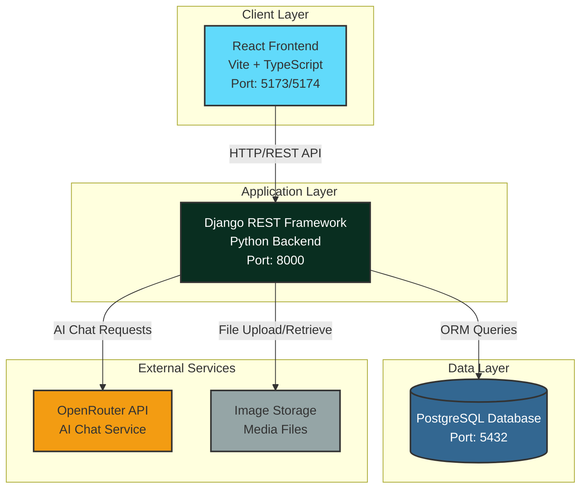
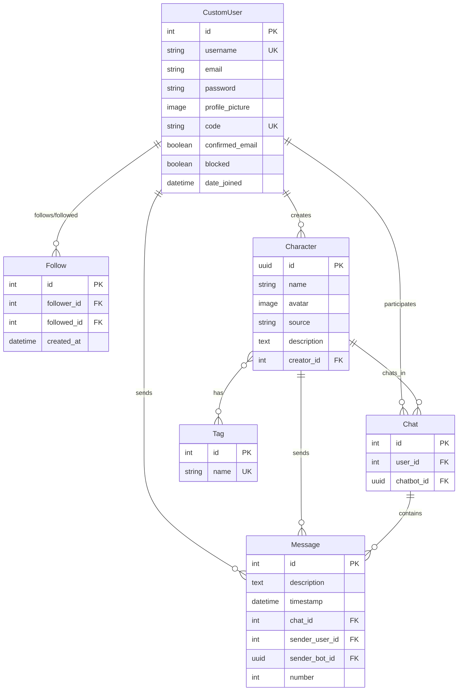
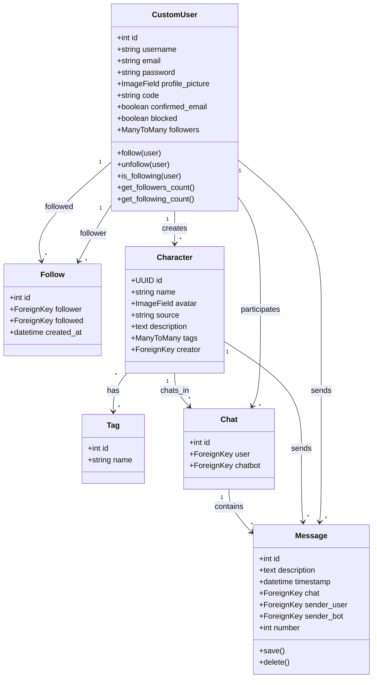
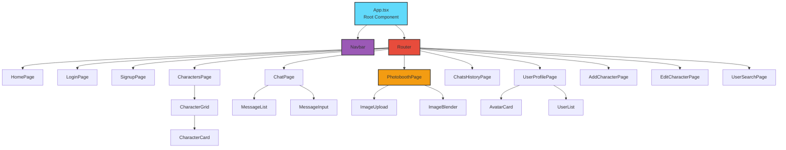
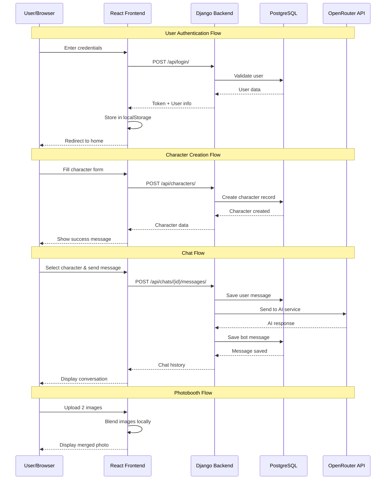
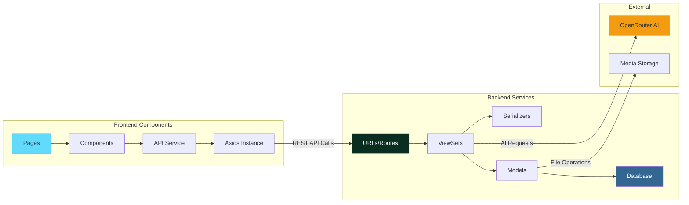
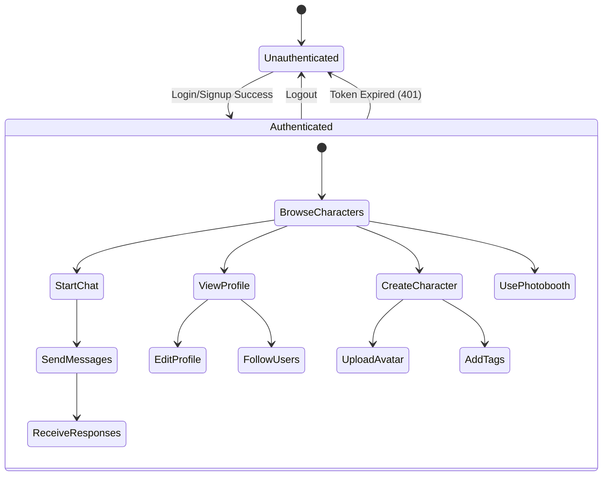
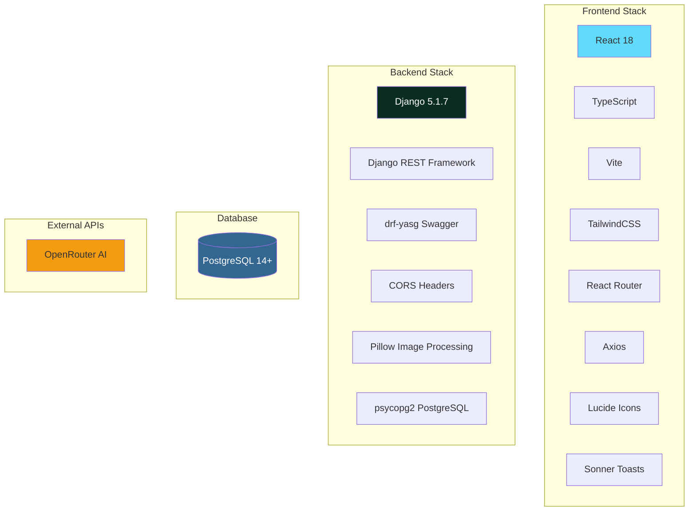
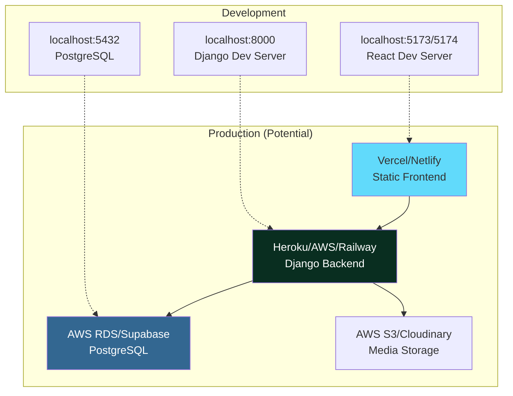
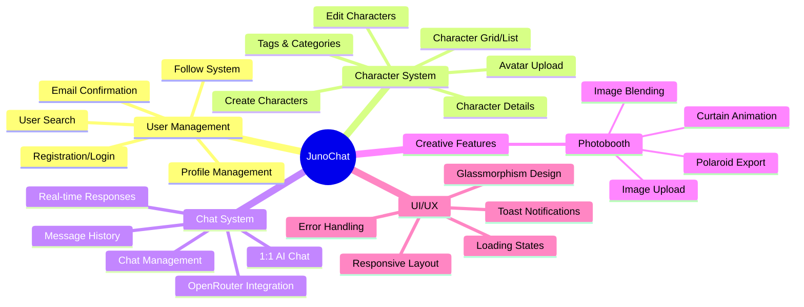

# JunoChat Architecture Diagrams

## System Overview

JunoChat is a Character AI-like platform built with React (frontend), Django (backend), and PostgreSQL (database). Users can chat with AI-powered characters, create their own characters, and use creative features like the Photobooth.

---

## 1. High-Level Architecture Diagram

---

## 2. Database Schema (Entity Relationship Diagram)

---

## 3. Backend Class Diagram (Django Models)

---

## 4. Frontend Architecture (Component Hierarchy)

---

## 5. API Flow Diagram (Request/Response Cycle)

---

## 6. Component Interaction Diagram

---

## 7. Authentication & Authorization Flow

---

## 8. Technology Stack

---

## 9. Deployment Architecture

---

## 10. Feature Map

---

## API Endpoints Overview

### Authentication
- `POST /api/login/` - User login
- `POST /api/signup/` - User registration
- `POST /api/logout/` - User logout

### Users
- `GET /api/users/` - List users
- `GET /api/users/{id}/` - User detail
- `PUT /api/users/{id}/` - Update user
- `GET /api/users/search/` - Search users
- `POST /api/users/{id}/follow/` - Follow user
- `POST /api/users/{id}/unfollow/` - Unfollow user

### Characters
- `GET /api/characters/` - List characters
- `POST /api/characters/` - Create character
- `GET /api/characters/{id}/` - Character detail
- `PUT /api/characters/{id}/` - Update character
- `DELETE /api/characters/{id}/` - Delete character

### Chats
- `GET /api/chats/` - List user chats
- `POST /api/chats/` - Create chat
- `GET /api/chats/{id}/` - Chat detail
- `POST /api/chats/{id}/messages/` - Send message
- `GET /api/chats/{id}/messages/` - Get messages

### Tags
- `GET /api/tags/` - List tags
- `POST /api/tags/` - Create tag

---

## Key Design Patterns Used

1. **MVC/MVT Pattern** - Django follows Model-View-Template (adapted to REST API)
2. **Repository Pattern** - Django ORM acts as repository layer
3. **Component-Based Architecture** - React components for reusability
4. **RESTful API Design** - Standard HTTP methods and status codes
5. **Token-Based Authentication** - Django REST Framework tokens
6. **Middleware Pattern** - CORS, Authentication, Error handling
7. **Observer Pattern** - React state management and re-rendering
8. **Factory Pattern** - Django model managers and querysets

---

## Security Features

- Token-based authentication
- CSRF protection
- CORS configuration
- Password hashing (Django default)
- SQL injection protection (ORM)
- XSS protection (React escaping)
- Input validation (serializers)
- File upload validation

---

## Performance Optimizations

- Database indexing on foreign keys
- React code splitting with lazy loading
- Image optimization (Pillow)
- API response caching (potential)
- Database connection pooling
- Static file serving
- Pagination for large datasets

---

*Generated: November 2, 2025*  
*Version: 1.0*  
*Branch: photobooth*
